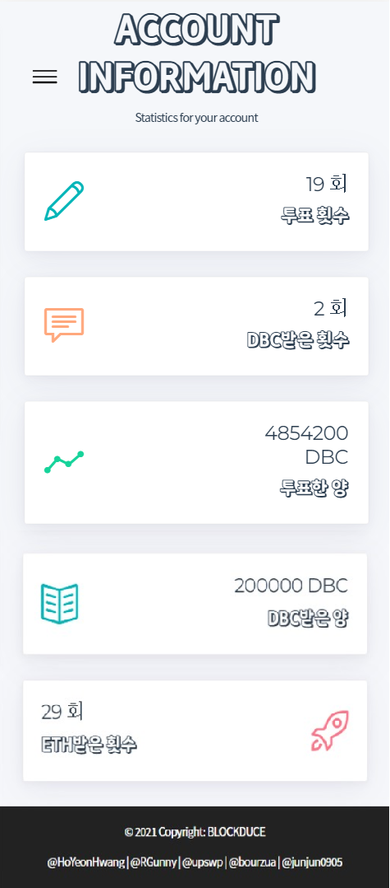

- # BLOCKDUCE

  ---

  

  > [**BLOCKDUCE** **LINK**📌](http://j4b107.p.ssafy.io/))

---

|     Name     |                            황호연                            |                            류건희                            |                            박상우                            |                            최주아                            |                            황영준                            |
| :----------: | :----------------------------------------------------------: | :----------------------------------------------------------: | :----------------------------------------------------------: | :----------------------------------------------------------: | :----------------------------------------------------------: |
| **Profile**  |  |  |  |  |  |
|   **R&R**    |                           **팀장**                           |                           **팀원**                           |                           **팀원**                           |                           **팀원**                           |                           **팀원**                           |
|   **Git**    |        [@HoYeonHwang](https://github.com/HoYeonHwang)        |             [@RGunny](https://github.com/RGunny)             |              [@upswp](https://github.com/upswp)              |            [@bourzua](https://github.com/bourzua)            |         [@junjun0905](https://github.com/junjun0905)         |
| **Position** |       Blockchain, Backend, Frontend, Project Manager        |                 Backend, CI/CD, Tech Leader                  |                         Backend, QA                          |                           Frontend                           |                    Backend, Frontend, DBA                    |

  ## Team Communication Rule 🤙

  - Webex는 09:00 - 18:00 까지 항상 Online !

    - 비대면을 위한 개발환경이지만 모두를 위한 매너는 지킵시다!

  - 질문은 언제나 자유롭게 !

    - 프로젝트를 진행하며 책임은 철저히! 고민은 다 같이 !

  - 약속시간은 모두를 위한 약속 !

    - 비대면으로 이뤄지는 모든 환경은 오해를 하기 쉬운 환경이므로 문제가 생기면 항상 사전에 미리미리 말하기!

  - ### [Git Convention🧐](docs/Git Setting.md)

  - ### [JIRA Convention🤓](docs/JIRA Convention.md) 

---

  

  - 프로듀스 101 투표조작 사건을 기반으로 올바른 온라인 투표 시스템 문화 정착을 위한 프로젝트입니다.
  - 블록체인을 이용하여 누구나 믿을 수 있는 온라인 투표 시스템 BLOCKDUCE를 기획했습니다.

---

  

---
## Pipeline

### 1. System

### 2. Develop

### 3. 카카오 로그인 구조

## Git Graph

- Git Flow 방식 사용

## Service Page

### 1.1 로그인

- 일반 로그인 / 카카오 로그인 기능

### 1.2. 카카오 로그인(카카오 계정 연동)

### 1.3 일반 회원가입

- 일반 회원가입 기능
  - 프로필 이미지, 이름, 닉네임, 자기소개, 이메일, 비밀번호

### 1.4 메일 인증

- 회원가입한 이메일로 SMTP를 이용하여 인증 메일 요청

### 2. 메인 페이지

### 3.1 계정 페이지

- 계정의 정보를 확인할 수 있습니다.
  - 이름, 자기소개, 지갑 주소(이더리움), DBC 보유량, ETH(이더리움) 보유량

### 3.2 계정 생성 페이지 (이더리움 지갑)

- 사용자의 이더리움 지갑을 생성
  - 생성시,  이더리움 퍼블릭 네트워크에 연동되는 계정 지급
    - 지갑 주소(Ethereum Account), 비밀 키(Private Key)

### 3.3 계정 통계 페이지

- 사용자의 투표 및 보상 정보 확인
  - 투표 횟수, DBC 받은 횟수, 투표한 DBC 양, 지급받은 DBC 양, ETH(이더리움) 받은 횟수
    - DBC는 BLOCK DUCE에서 투표에 사용되는 재화 입니다. ETH는 투표에 대한 보상으로 받는 재화

### 4.1 투표 페이지

- 사용자가 후보들에게 투표하는 페이지
  - 사용자의 DBC 보유량 확인(내 DBC 확인)
  - 투표가능한 일일 DBC 지급(오늘의 보상)
  - 사용자가 투표한 정보(투표 정보)
  - 후보자 정보 확인
  - 원하는 DBC 양만큼 후보자에게 투표 (블록체인 저장)
    - 원활한 서비스 이용을 위하여 사용자 대신, 서비스에서 투표 정보에 서명 후 컨트랙트 발생

### 4.2 나의 투표 정보(Month)

- 월별 사용자의 투표 정보 확인
  - 투표한 기록이 있는 날짜에 표시
  - 해당 날 클릭 시, 상세보기 지원

### 4.3 나의 투표 상세 내역(Day)

- 사용자의 특정 날 투표 정보 내역 표시
  - 날짜, 투표 대상, 투표한 DBC 양, 해당 날 투표한 DBC 총량
  - 투표한 후보자 클릭 시, 이더리움 퍼블릭 네트워크로 연동(블록체인 트랜잭션 내역 확인)

### 5. 투표 현황 페이지

- 현재 투표 순위 표시

  - 후보자 클릭 시, 이더리움 퍼블릭 네트워크로 연동(블록체인 트랜잭션 내역 확인)

  

### 6.1 이더리움 퍼블릭 네트워크 연동

- 퍼블릭 네트워크에 올라간 투표 내역(트랜잭션) 확인

### 6.2 ERC20 토큰 컨트렉트

- 이더리움 퍼블릭 네트워크에서 투표 내역(DBC)에 대한 컨트렉트 확인

## 기술 스택

    
Front 자세히 살펴보기 🌈

    <ul>
        <li>기술스택 ⚙</li>
    </ul>   
    <ul>
        <li>Vue: 2.6.11</li>
    </ul>
     <ul>
        <li>라이브러리 📚</li>
    </ul>   
    <ul>
        <li>Vue: 2.6.11</li>
    </ul>

  

      
Back 자세히 살펴보기 🔥

      <ul>
          <li>Swagger: 2.9.2</li>
          <li>Spring Boot</li>
          <li>Spring Data JPA</li>
          <li>Spring Security</li>
          <li>Gradle</li>
          <li>SMTP</li>
          <li>MySQL 8.0.21</li>
          <li>Redis</li>
      </ul>
  

  

      
개발, CI/CD 자세히 살펴보기 🔥

      <ul>
          <li>AWS EC2 - Deploy Server</li>
          <li>AWS S3 - Image(File) Server</li>
          <li>AWS RDS - DB Server</li>
          <li>Jenkins </li>
          <li>GitLab</li>
          <li>Docker Compose</li>
      </ul>
  

   

---

